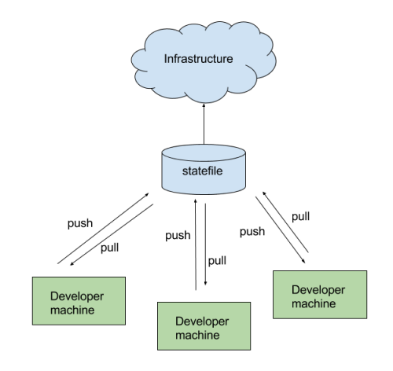

# Terraform Locking State in S3 Amazon Web Services

## Intro

When you are building infrastructure with terraform config, a state file, called ```terraform.tfstat```, gets generated locally in the ```.terraform``` directory.
This state file contains information about the infrastructure and configuration that terraform is managing.
When working on a team, it is better to store this state file remotely so that more folks can access it to make changes to the infrastructure.

## Whats in the state file?

The state file contains information about what real resources exist for each object defined in the terraform config files.
For example, if you have a DNS zone resource created in your terraform config, then the state file contains info about the actual resource that was created on AWS.

Here is an example of creating a DNS zone with Terraform along with its state file:
```
# example.tf
# create a DNS zone called example.com
resource "aws_route53_zone" "example_dns_zone" {
  name = "example.com"
}

# terraform.tfstate
# in the state file, the DNS zone ID along with its name is stored
"aws_route53_zone.example_dns_zone": {
  "type": "aws_route53_zone",
  "primary": {
    "id": "Z2D3OUXZHH4NUA",
    "attributes": {
      "name": "example.com"
    }
  }
},
```
## Store State Remotely in S3
If you are working on a team, then its best to store the terraform state file remotely so that many people can access it.
In order to setup terraform to store state remotely you need two things: an s3 bucket to store the state file in and an terraform s3 backend resource.

You can create an s3 bucket in a terraform config like so:
```
# example.tf
provider "aws" {
  region = "us-west-2"
}

# terraform state file setup
# create an S3 bucket to store the state file in
resource "aws_s3_bucket" "terraform-state-storage-s3" {
  bucket = "terraform-remote-state-storage-s3"

  versioning {
    enabled = true
  }

  lifecycle {
    prevent_destroy = true
  }

  tags {
    Name = "S3 Remote Terraform State Store"
  }
}
```
Then create the s3 backend resource like so:

```
# terraform.tf
terraform {
  backend "s3" {
    encrypt = true
    bucket = "terraform-remote-state-storage-s3"
    region = us-west-2
    key = path/to/state/file
  }
}
```

## What is locking and why do we need it?
If the state file is stored remotely so that many people can access it, then you risk multiple people attempting to make changes to the same file at the exact same time.
So we need to provide a mechanism that will “lock” the state if its currently in-use by another user. We can accomplish this by creating a dynamoDB table for terraform to use.

Create the dynamoDB table like this:

```
# example.tf
# create a dynamodb table for locking the state file
resource "aws_dynamodb_table" "dynamodb-terraform-state-lock" {
  name = "terraform-state-lock-dynamo"
  hash_key = "LockID"
  read_capacity = 20
  write_capacity = 20

  attribute {
    name = "LockID"
    type = "S"
  }

  tags {
    Name = "DynamoDB Terraform State Lock Table"
  }
}
```

### Final step to push the state file:
Once you’ve created the S3 bucket and dynamoDB table, along with the backend S3 resource referencing those,
then you can run your terraform configs like normal with terraform plan and terraform apply commands and the state file will show up in the s3 bucket.
After those commands, if you inspect .terraform/terraform.tfstate, you will see that it contains the location of the state file now instead of the actual state file.

```
cat .terraform/terraform.tfstate
{
  "version": 3,
  "backend": {
    "type": "s3",
    "config": {
      "bucket": "terraform-remote-state-storage-s3",
      "dynamodb_table": "terraform-state-lock-dynamo",
      "encrypt": true,
      "key": "example/terraform.tfstate",
      "region": "us-west-2"
    }
  }
}
```
If you already have a local state file you will probably want to push it up to S3. So, run:

```terraform remote push```

Now whenever you run a terraform plan or terraform apply the remote state will be pulled down to your local machine and you (probably) will not clobber another developer’s changes. Finally when you apply a change the resulting changes state will be uploaded to the remote server.

To pull changes from the remote state you can simply run:

```terraform remote pull```


